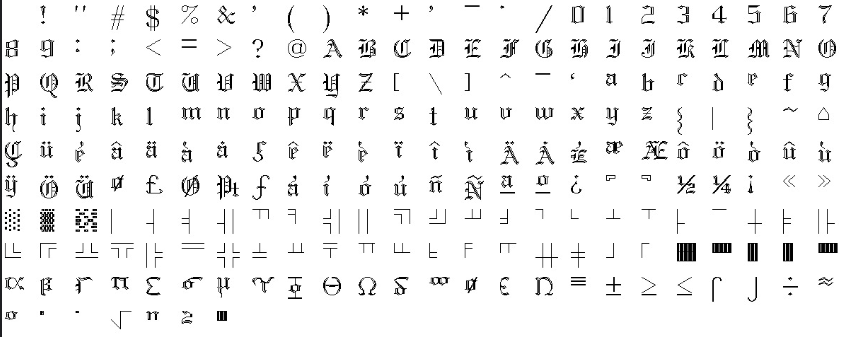
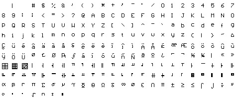
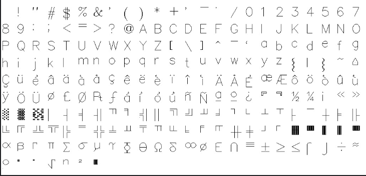

# BGI Stroked Fonts

[](https://crates.io/crates/bgi-stroked-fonts)
[](https://docs.rs/bgi-stroked-fonts)
[](LICENSE)

A pure Rust library providing Borland Graphics Interface (BGI) stroked font data. This library includes various font styles like bold, gothic, sans-serif, and script fonts for legacy graphics applications and retro computing projects.

## Features

- **Pure Rust**: No external dependencies (except optional regex for conversion utilities)
- **Multiple Font Styles**: Bold, Euro, Gothic, Sans-serif, Script, and more
- **Feature Flags**: Enable only the fonts you need to reduce binary size
- **No Unsafe Code**: Memory-safe implementation
- **Legacy Compatible**: Based on SDL_bgi font data

## Available Fonts

The library includes the following font styles:

- **Bold** (`bold`) - Bold stroked font
- **Euro** (`euro`) - European character set
- **Gothic** (`goth`) - Gothic style font
- **Small Complex** (`lcom`) - Small complex font
- **Small** (`litt`) - Small/little font
- **Sans-serif** (`sans`) - Clean sans-serif font
- **Script** (`scri`) - Script/cursive font
- **Simple** (`simp`) - Simple stroked font
- **Triplex** (`trip`) - Triplex font style
- **Triplex Script** (`tscr`) - Triplex script font

## Font Samples

Here are some examples of the available fonts:

### Gothic Font


### Small Font


### Simple Font


## Installation

Add this to your `Cargo.toml`:

```toml
[dependencies]
bgi-stroked-fonts = "0.1.0"
```

### Feature Flags

By default, all fonts are included. You can reduce binary size by enabling only the fonts you need:

```toml
[dependencies]
bgi-stroked-fonts = { version = "0.1.0", default-features = false, features = ["goth", "sans"] }
```

Available features:
- `bold` - Bold font
- `euro` - Euro font
- `goth` - Gothic font
- `lcom` - Small complex font
- `litt` - Small font
- `sans` - Sans-serif font
- `scri` - Script font
- `simp` - Simple font
- `trip` - Triplex font
- `tscr` - Triplex script font

## Usage

```rust
use bgi_stroked_fonts::goth;

fn main() {
    // Access font data
    let font_data = &goth::GOTH;        // Font stroke data
    let font_widths = &goth::GOTH_WIDTH; // Character widths
    let font_sizes = &goth::GOTH_SIZE;   // Character sizes

    // Each character is represented as stroke data
    // font_data[char_index] contains the stroke commands for that character

    // Example: Get data for character 'A' (ASCII 65)
    let char_a_strokes = font_data[65];
    println!("Character 'A' has {} stroke bytes", char_a_strokes.len());
}
```

## Font Data Format

Each font provides three arrays:
- **Font data** (`FONT`): Array of stroke data for each character (0-255)
- **Widths** (`FONT_WIDTH`): Character width information
- **Sizes** (`FONT_SIZE`): Size information for each character

The stroke data uses a simple line-drawing format where each stroke is represented by 4 bytes: `[x0, y0, x1, y1]` representing a line from point (x0, y0) to point (x1, y1).

## Examples

Check out the `examples/` directory for usage examples:

```bash
cargo run --example showcase
```

This will generate PGM image files demonstrating all available fonts.

## Building

```bash
# Build the library
cargo build

# Build with specific features only
cargo build --no-default-features --features "goth,sans"

# Run tests
cargo test

# Generate documentation
cargo doc --open
```

## License

This project is licensed under the ZLIB License - see the [LICENSE](LICENSE) file for details.

## Attribution

Based on font data from [SDL_bgi](https://sdl-bgi.sourceforge.io/) by Guido Gonzato, PhD.

Original BGI fonts were part of the Borland Graphics Interface, used in classic DOS graphics programming.

## Contributing

Contributions are welcome! Please feel free to submit a Pull Request.
